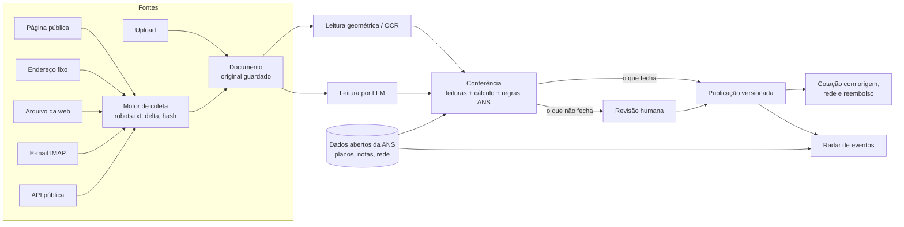

# Radar do Cotador

Protótipo para o desafio técnico do Cotador de Planos de Saúde. Cada tabela de venda em PDF é lida duas vezes: uma leitura geométrica (ou OCR) e uma leitura por LLM. As duas são conferidas entre si e contra os dados abertos da ANS. Uma pessoa só revisa o que não fecha. Depois, o sistema publica versões com origem e vigência e avisa o que mudou.

- **Detalhes técnicos** (medições, regras e tabelas completas por trás de cada número): [`docs/detalhes-tecnicos.md`](docs/detalhes-tecnicos.md)
- **Como evoluir** (princípios, receitas de extensão, escala, próximos passos): [`docs/como-evoluir.md`](docs/como-evoluir.md)
- **As operadoras do Cotador, uma a uma** (canais, robots.txt, amostras lidas): [`docs/operadoras/`](docs/operadoras/)
- **A pesquisa** (fontes, normas, mapa das operadoras): [`docs/pesquisa/fontes-e-achados.md`](docs/pesquisa/fontes-e-achados.md)



## Rodar

```bash
docker compose up
```

Abra http://localhost:8000. A primeira subida leva de 5 a 10 minutos:
- baixa uns 130 MB de dados abertos da ANS e monta o índice local;
- processa os 23 PDFs do acervo de demonstração.

A segunda leitura, por LLM, liga sozinha quando há uma chave de API no `.env`:

```bash
cp .env.example .env
```

Preencha uma das chaves: `OPENAI_API_KEY` (GPT-6 Luna, o padrão), `GEMINI_API_KEY` (Gemini 3.8 Flash) ou `ANTHROPIC_API_KEY` (Claude). `LEITOR_MODELO` troca o modelo. Sem chave, valem as leituras já gravadas em `amostras/leituras_llm/` (marcadas como "gravada" na tela); para um PDF novo, fica a leitura geométrica/OCR mais as regras da ANS.

## O que olhar

| Tela | O que mostra |
|---|---|
| **Painel** | preços lidos, quanto passou sem revisão humana, operadoras do Cotador × cadastro da ANS (a Saúde Sim aparece cancelada) |
| **Documentos** → `unimed_guarulhos_pme_2026.pdf` | a página do PDF com cada preço destacado; o único preço apontado (abaixo do piso da nota técnica da ANS); aprovar ou corrigir |
| **Documentos** → `unimed_guarulhos_pme_2026_ESCANEADA.pdf` | o mesmo material "escaneado" (simulado), lido por OCR |
| **Radar** | reajuste da Unimed BH, produtos retirados da Rio Preto, Affix × CORPe com preços diferentes, planos suspensos na ANS, nota técnica nova depois da tabela publicada, hospital que sai da rede com data deferida pela ANS |
| **Tabelas publicadas** → Histórico | versões de cada produto com a variação faixa a faixa, inclusive as que vieram do arquivo da web |
| **Cotação** (ex.: idades 38, 36, 9; UF do cliente) | preço por pessoa com selo de origem; reembolso, coparticipação e acomodação do registro na ANS; rede hospitalar do plano no estado; mudança de rede a caminho; a tabela antiga da Affix aparece marcada |
| **Fontes** | cada fonte com seus fluxos de captura (página, endereço fixo, API, arquivo da web, e-mail) e o resultado da última coleta; "Coletar agora" em cada um |

Enviar um PDF novo pela tela de Documentos dispara o mesmo processo.

## Desenvolvimento sem Docker

```bash
python3 -m venv .venv && .venv/bin/pip install -r requirements.txt
```

Suba o Postgres:

```bash
docker run -d --name cotador-db -e POSTGRES_USER=cotador -e POSTGRES_PASSWORD=cotador -e POSTGRES_DB=cotador -p 55432:5432 postgres:16-alpine
```

Prepare o banco e carregue o acervo:

```bash
cd backend && ../.venv/bin/python manage.py migrate && ../.venv/bin/python manage.py carregar_demo
```

Suba a API:

```bash
cd backend && ../.venv/bin/python manage.py runserver
```

O frontend em modo de desenvolvimento usa o proxy do Vite para `/api` → `:8000`:

```bash
cd frontend && npm install && npm run dev
```

Para gerar o build do frontend, que o Django serve na raiz:

```bash
cd frontend && npm run build
```

## Coleta

Cada fonte (quem publica) tem um ou mais fluxos de captura (por onde o material chega). Na tela de Fontes, cada captura tem o botão "Coletar agora":

| Tipo de captura | Exemplo no protótipo | O que faz |
|---|---|---|
| Página pública com links | Allcare, página de materiais de venda | lê a página, acha os PDFs de tabela, baixa só o que mudou (ETag, Last-Modified e hash) |
| Endereço fixo do material | Unimed Guarulhos, Qualicorp | baixa o PDF quando muda; as duas aparecem **bloqueadas pelo robots.txt**, e o motor respeita |
| API pública em JSON | CORPe, tabelas Hapvida | lê a lista de materiais que a página monta em JavaScript; 53 tabelas, cada uma com a data da versão |
| Histórico no arquivo da web | Allcare, versões que ela já tirou do ar | consulta a API CDX da Wayback Machine e baixa uma vez cada versão antiga das tabelas acompanhadas; a versão antiga entra no histórico e nunca vira o preço vigente |
| Caixa de e-mail | Unimed Guarulhos, e-mail comercial (simulado) | lê a caixa por IMAP, só para leitura, e aceita o PDF (solto ou em .zip) só de remetente autorizado e autenticado (DKIM/DMARC) |

As fontes e capturas ficam em `fontes/*.json`. Fonte nova de um tipo que já existe é um arquivo novo, sem código; um tipo novo é uma classe em `coletor/`. Para validar e carregar:

```bash
PYTHONPATH=. .venv/bin/python -m coletor.fontes
```

```bash
cd backend && ../.venv/bin/python manage.py carregar_fontes
```

Pela linha de comando, que é o que o agendador chama (`--fonte` para todas as capturas de uma fonte, `--captura` para uma só):

```bash
cd backend && ../.venv/bin/python manage.py coletar --fonte Allcare
```

No Docker, a coleta diária fica num perfil à parte, para o `docker compose up` padrão não sair baixando de sites de terceiros:

```bash
docker compose --profile coleta up
```

### Demonstração da caixa de e-mail

O perfil `email` sobe um servidor de e-mail local (GreenMail). O comando `simular_email` manda três mensagens: uma da operadora, autenticada, com a tabela num .zip; uma com o mesmo remetente sem autenticação; uma de outro domínio. A captura aceita só a primeira.

```bash
docker compose --profile email up -d
```

```bash
docker compose exec app python backend/manage.py simular_email
```

Depois, em Fontes → Unimed Guarulhos → "E-mail comercial (simulado)" → Coletar agora.

## Rede hospitalar e mudanças de rede (ANS)

A rede hospitalar de cada plano e os pedidos de mudança de rede vêm dos dados abertos da ANS. O zip da rede tem 1,4 GB; o comando baixa por HTTP Range só o trecho de cada UF e guarda só os planos acompanhados:

```bash
cd backend && ../.venv/bin/python manage.py baixar_rede_ans
```

A cotação mostra a rede de cada plano (hospitais, quantos com pronto-socorro, lista por UF) e avisa quando a ANS deferiu a saída de um hospital, com a data em que vale. A carga de demonstração traz um recorte pronto em `amostras/ans/rede.sqlite`.

## Leitor pela linha de comando

```bash
.venv/bin/python -m leitor.cli amostras/publicas/unimed_guarulhos_pme_2026.pdf
```

Opções:
- `--llm` faz a segunda leitura, página por página, com o modelo do `.env`;
- `--modelo` escolhe outro modelo (ex.: `gpt-6-luna`, `gemini-3.8-flash`);
- `--replay` usa uma leitura gravada, sem chamar a API.

## Testes

Tudo de uma vez (fontes, testes, migrações e build do frontend):

```bash
./verificar.sh
```

Ou por partes:

```bash
.venv/bin/python -m pytest
```

```bash
cd backend && ../.venv/bin/python manage.py test radar
```

Os primeiros usam os PDFs reais do acervo e os casos de fronteira encontrados neles: cabeçalho quebrado, tabelas lado a lado, texto girado, odonto embutido no preço, colunas trocadas entre versões, robots.txt com linha em branco, e-mail com remetente falsificado. Os do Django cobrem o que depende do banco: versão antiga que chega depois da atual, cópia arquivada na série da tabela viva, robots.txt do site original valendo para a cópia, aviso de mudança de rede.

## Estrutura

```
leitor/            núcleo, sem Django: PDF, leitor geométrico, OCR, LLM, regras da ANS, cálculo, conferência, versões
coletor/           captura, sem Django: robots.txt, download condicional, tipos de captura (página pública, endereço fixo, API pública, Wayback, e-mail)
fontes/            as fontes e seus fluxos de captura, em JSON (uma fonte nova é um arquivo)
backend/radar/     modelos, pipeline (servicos.py), API, carga de demonstração
frontend/          React + Vite + Tailwind
amostras/          25 PDFs públicos (manifest.json com URL, data de coleta e hash) e o PDF escaneado simulado
docs/              proposta, detalhes técnicos, como evoluir, operadoras e pesquisa
```

## Real × simulado

- **Real:**
  - os dados abertos da ANS, baixados do portal oficial;
  - os PDFs, materiais públicos de operadoras e administradoras usados aqui só para demonstração, com origem registrada no `manifest.json`;
  - a coleta da Allcare, pela página pública de materiais ("Coletar agora" em Fontes).
- **Simulado:**
  - o PDF escaneado, gerado a partir de um real;
  - a aprovação humana das versões antigas, feita pela carga de demonstração para montar o histórico;
  - as demais fontes de PDF, que entram por upload: Unimed e Qualicorp bloqueiam robôs no robots.txt.

Detalhes na seção 8 da proposta.
