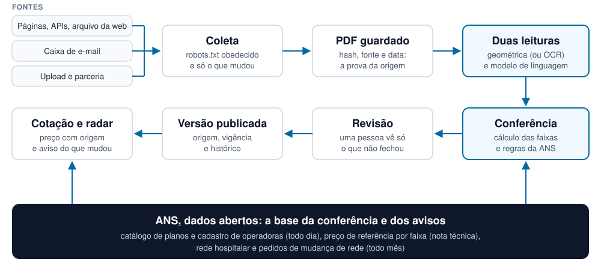

<!-- classe: capa -->
# Radar do Cotador

Tabelas de preço que se conferem sozinhas

**Gustavo Henrique** · desafio técnico do Cotador de Planos de Saúde · outubro de 2026

---

<!-- rotulo: O problema -->
## Dois problemas que se alimentam

- **Acesso limitado:** parte do material fica em portal restrito ou depende de contato interno.
- **Atualização manual:** cada preço é lido e digitado, plano por plano, operadora por operadora.
- **O dado muda o tempo todo:** só em 2026, um concorrente publicou 225 avisos de mudança de tabela, em 106 dias diferentes.
- **A desatualização já aparece:** a Saúde Sim, com registro cancelado na ANS em 2022, ainda estava na página do Cotador.

O corretor precisa do preço certo, do preço atual e de saber de onde ele veio.

---

<!-- rotulo: A ideia -->
## Trocar a digitação por conferência

1. Buscar o material onde ele é publicado ou recebido.
2. Ler cada tabela duas vezes, de jeitos independentes.
3. Conferir tudo contra os dados abertos da ANS.
4. Chamar uma pessoa só para o que não fecha.
5. Publicar cada preço com a sua origem e avisar quando algo muda.

---

<!-- classe: numeros -->
<!-- rotulo: Resultados no acervo real -->
## O que o protótipo já mostra

- **81,1%** dos preços passam sem revisão humana, nos produtos que o PDF identifica pelo registro ANS
- **137** tabelas nunca vistas, em dois testes às cegas, sem nenhuma divergência entre as leituras
- **9 de 9** operadoras da página do Cotador mapeadas, uma a uma
- **US$ 0,001** por página na segunda leitura; o acervo inteiro custou US$ 0,35

---

<!-- rotulo: Obtenção dos dados -->
## Nenhuma das 9 operadoras publica a tabela vigente aberta

| Como o preço chega | Operadoras | O que o sistema faz |
|---|---|---|
| Administradoras que publicam | NotreDame e Hapvida, pela Allcare, CORPe, Affix e Safe | coleta da página, da API ou do arquivo da web, baixando só o que mudou |
| Canal fechado ou fonte que não aceita robô | Bradesco, SulAmérica, Amil, CNU, Smile e Quallity | caixa de e-mail dedicada, só de remetente autenticado, e upload |
| Nenhum: operadora extinta | Saúde Sim | o radar avisa que o registro foi cancelado |

Sem login, robots.txt obedecido e parceria onde os termos proíbem robôs.

---

<!-- classe: figura -->
<!-- rotulo: Estrutura -->
## Do PDF da operadora à cotação, com a ANS por baixo

---

<!-- rotulo: Redução do trabalho manual -->
## Duas leituras e uma conta

- **Leitura geométrica (ou OCR):** acha as faixas etárias e pega os valores pela posição na página.
- **Leitura por modelo de linguagem:** entende a estrutura da tabela, página por página.
- **Cálculo:** o percentual entre as faixas refaz cada preço. Em 1.434 erros de digitação plantados, apontou todos os acima de 0,1%.
- **Quando discordam,** a célula vai para uma pessoa, com o PDF ao lado e o número destacado.

O modelo de linguagem nunca publica nada sozinho.

---

<!-- rotulo: Confiabilidade -->
## Regras com base legal, testadas nos dados

| Regra | O que verifica |
|---|---|
| Faixas etárias (RN 563) | a última faixa até 6 vezes a primeira, e nenhum preço caindo com a idade |
| Preço de referência (RN 564) | o preço contra a nota técnica do plano da época certa |
| Situação na ANS (RN 543) | plano suspenso, plano cancelado ou operadora cancelada sendo vendidos |
| Catálogo da ANS | registro que não existe: a Safe imprime um que não está no catálogo |

---

<!-- rotulo: Nos dados reais -->
## Problemas que estavam passando

- **Operadora extinta na lista:** a Saúde Sim, cancelada em 2022, aparecia na página do Cotador.
- **Plano suspenso à venda:** planos com venda suspensa desde 11/2024 numa tabela de 2026.
- **Preço velho mais barato:** a mesma tabela Hapvida DF 9,7% abaixo numa fonte, por ser de 2025.
- **Hospital fora da rede:** a ANS deferiu a saída do Hospital Mogiano de 9 planos publicados.

---

<!-- rotulo: Plano de implementação -->
## Começar pelo que dá valor no primeiro dia

| Fase | Entrega |
|---|---|
| 1 · semanas 1 e 2 | saúde da base atual contra a ANS, com rede e reembolso do registro oficial |
| 2 · semanas 2 a 6 | dupla leitura, tela de revisão e publicação versionada |
| 3 · semanas 6 a 10 | radar de mudanças, selo de origem na cotação e coleta agendada |
| 4 · depois | parcerias com as operadoras de canal fechado e envio de tabelas pelos corretores |

A meta inicial de automação é 75%; o protótipo chega a 81,1%.

---

<!-- rotulo: No caminho -->
## O que deu errado com dados reais, e a correção de cada caso

- Um modelo que resumia documentos longos passou a ler página por página: confirmação de 28% para quase 100%.
- Uma coluna escondida no PDF deixou de ser lida: o leitor confere cada palavra contra a página desenhada.
- Reajustes falsos sumiram com a comparação pela condição de venda, e não pela posição.
- O robots.txt passou a ser lido como manda a norma, com curinga.
- Material antigo nunca mais vira o preço vigente.

---

<!-- classe: capa -->
# Para ver e testar

Protótipo completo, no ar na AWS: **endereço no README**

Versão estática, no navegador: **gustavohenriquers.github.io/radar-cotador**

Código e documentação: **github.com/GustavoHenriqueRS/radar-cotador**

Na própria máquina: `docker compose up`
